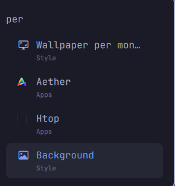

# Omarchy Wallpaper Per Monitor

Choose a different wallpaper for each monitor **without changing your Omarchy
theme**. Set images by monitor name or use separate defaults for portrait and
landscape displays, including rotated monitors.

This community plugin for Omarchy 4 replaces the built-in background renderer.
Your theme, colors and other desktop preferences remain independent of your
per-monitor wallpaper choices.

[Install](#install) · [Usage](#usage) · [Configuration](#configuration) ·
[Uninstall](#uninstall) · [Security](.github/SECURITY.md)

## Requirements

- Omarchy 4 with its Quickshell-based shell and Hyprland.
- Python 3, jq and the standard tools supplied by Arch Linux.
- Linux `/proc` and child-subreaper support for process cleanup.

The installer checks required tools before changing configuration. It does not
install packages or download additional code.

## Install

```bash
git clone https://github.com/vitorcanoas/omarchy-wallpaper-per-monitor.git
cd omarchy-wallpaper-per-monitor
DRY_RUN=1 ./install.sh   # preview in a temporary directory under HOME
./install.sh
omarchy restart shell
```

Run the scripts directly so their Bash startup protections apply. The shell
restart reloads the plugin; it does not end your desktop session.

Find your monitor names and assign any local images:

```bash
wallpaper-monitor list
wallpaper-monitor set DP-2 ~/Pictures/wallpapers/landscape.png
wallpaper-monitor set HDMI-A-1 ~/Pictures/wallpapers/portrait.png
```

These commands change wallpaper overrides only. They do not apply a theme.

## Usage

### Per-monitor wallpapers and orientation defaults

```bash
wallpaper-monitor set DP-2 /path/to/image.png
wallpaper-monitor set-portrait /path/to/portrait.png
wallpaper-monitor set-landscape /path/to/landscape.png
wallpaper-monitor list

wallpaper-monitor clear DP-2
wallpaper-monitor clear-portrait
wallpaper-monitor clear-landscape
```

Image files must exist. Relative paths are resolved by the CLI before saving.
Clearing a monitor override restores its orientation default, if configured,
or the current Omarchy theme's wallpaper.

### Image catalogue and menu

For numbered shortcuts and the thumbnail menu, organize your images as:

```text
~/Pictures/wallpapers/render/
├── 16x9/    landscape images
└── 9x16/    portrait images
```

An existing catalogue can be selected with `WALLPAPER_MONITOR_DIR` pointing to
the directory containing `16x9/` and `9x16/`. Both tools also recognize a
catalogue from configured overrides already inside those subdirectories.
The CLI can use a checkout's `render/` directory as a final fallback.

```bash
wp             # list both catalogues
wp h           # list landscape images
wp v           # list portrait images
wp h 3         # apply landscape image 3
wp v 2         # apply portrait image 2
wp h 3 DP-2    # choose a specific monitor
```

If several monitors share an orientation, `wp` warns and uses the first.
Supply a monitor name to choose explicitly. Disabled outputs are skipped.

Press **SUPER+SPACE**, search for `per-monitor`, and select **Wallpaper per
monitor**. Choose a monitor, then an image from its orientation's catalogue.
Cancelling leaves the wallpaper unchanged. Interactive pickers have a
120-second selection deadline.



The menu uses Omarchy's existing thumbnail and selection tools. The native
background and theme controls remain available; choosing a theme is optional.

## Configuration

Overrides are stored in `~/.config/omarchy/background-per-monitor.json`:

```json
{
  "monitors": {
    "DP-2": "/home/you/Pictures/wallpapers/landscape.png",
    "HDMI-A-1": "/home/you/Pictures/wallpapers/portrait.png"
  },
  "portrait": "/home/you/Pictures/wallpapers/portrait-default.png",
  "landscape": "/home/you/Pictures/wallpapers/landscape-default.png"
}
```

For each screen, the renderer selects:

1. Its named monitor override.
2. Its portrait or landscape default.
3. The current Omarchy theme background.

Changes are picked up within about two seconds, without restarting the shell.
JSON image paths must be absolute or start with `~/`. An image that cannot
load falls back to the normal theme background. The older flat monitor-to-path
format is supported and migrated on the first CLI write, with a backup.

Configuration files are limited to 256 KiB. They must be regular files owned
by the user, without group/other write permission. Configuration directories
must also be user-owned, non-writable by group/others, and real directories:
symlinked path components are refused. Existing file permissions are preserved.
See the [security policy](.github/SECURITY.md) for the exact boundaries.

## Rotation and compatibility

A physical 1920×1080 panel with an odd Hyprland `transform` value displays a
1080×1920 portrait area. The CLIs account for that rotation when reading
`hyprctl monitors -j`; the renderer uses Quickshell's effective screen size.

The plugin declares `omarchy.clonedFrom: "omarchy.background"` and preserves
the native `background` IPC functions: `refresh`, `set`, `setInstant`,
`transition` and `themeTransition`. Replacing the built-in renderer avoids
competing wallpaper layers.

Tested on Omarchy 4.0.2-1 with two monitors: one landscape and one rotated
portrait. Automated tests cover filesystem and process boundaries, concurrent
CLI writes and installation/removal. Real-session checks cover loading,
per-monitor changes, image selection and cancellation while preserving the
current theme. More than two monitors, physical hotplug and other Linux
distributions remain untested. This is beta software.

## Installation scope

| Location under HOME | Purpose |
|---|---|
| `.config/omarchy/plugins/vitorcanoas.background-per-monitor/` | Explicit allowlist of plugin files |
| `.config/omarchy/shell.json` | Registers the plugin, disables the native background and records restoration ownership |
| `.config/omarchy/extensions/omarchy-menu.jsonc` | Adds a marker-delimited menu entry while preserving surrounding JSONC |
| `.local/bin/` | Adds `wallpaper-monitor`, `wp` and `wallpaper-monitor-menu` symlinks |
| `.config/omarchy/background-per-monitor.json` | Stores choices made through the CLI |

Existing configuration is backed up before installer edits. Installation and
removal are idempotent. No system services or privileged changes are required.

## Uninstall

From the checkout, run:

```bash
DRY_RUN=1 ./uninstall.sh
./uninstall.sh
omarchy restart shell
```

The uninstaller removes the plugin, its menu entry and its own CLI symlinks.
It restores the built-in background when this plugin's restoration record is
present, preserving unrelated plugins and configuration.

Your wallpaper JSON and timestamped configuration backups are kept. Foreign
files or symlinks at the CLI locations are left untouched.

## Development and credits

See [Contributing](.github/CONTRIBUTING.md) for validation commands and
[Changelog](CHANGELOG.md) for changes. Security reports should follow the
[security policy](.github/SECURITY.md).

Parts of the override selection and failed-image fallback logic are adapted
from DCPRevere's [Omarchy PR #10249](https://github.com/omacom/omarchy/pull/10249),
with attribution in `Background.qml`.

Licensed under [MIT](LICENSE).
